# Prompt Ambition Test

**Does asking a coding agent for ambition, or giving it a designer persona, change the quality of its creative work?**

Three Claude Code sessions (`claude-opus-5-5`) got the same task on the same day: make a motion-graphics video for one song. The only thing that changed between them was the prompt.

> **Research attempt, n = 1 per prompt.** Treat the differences as a signal to test further, not a settled result. See [Limitations](#limitations).

## The three prompts

| | Prompt (verbatim) | What it adds | Guidance it follows | Coolness |
|---|---|---|---|:---:|
| **P1 · Simple** | *Create motion graphics video for Claude Pop - I'm Upping My P(Doom) - (256 Kbps)* | The task only (baseline) | None | **7.6** |
| **P2 · Ambition** | *Create motion graphics video for Claude Pop - I'm Upping My P(Doom) - (256 Kbps).* **Go beyond the basics. Show me how good a motion designer you truly are.** | An explicit request for ambition | Anthropic, [Prompting best practices → Be clear and direct](https://platform.claude.com/docs/en/build-with-claude/prompt-engineering/claude-prompting-best-practices#be-clear-and-direct): *"If you want 'above and beyond' behavior, explicitly request it."* The guide's own example prompt says *"Go beyond the basics."* | **8.9** |
| **P3 · Ambition + Persona** | **You are the founding designer at a small motion graphics studio.** *Create motion graphics video for Claude Pop - I'm Upping My P(Doom) - (256 Kbps). Go beyond the basics. Show me how good a motion designer you truly are.* | A designer persona on top of P2 | Anthropic's [`frontend-design` skill](https://github.com/anthropics/skills/blob/main/skills/frontend-design/SKILL.md), which opens with a studio design-lead persona. It was introduced in [#1293](https://github.com/anthropics/skills/pull/1293) (9 Jun 2026) and last updated in [#1713](https://github.com/anthropics/skills/pull/1713) (3 Sep 2026). See also [Prompting best practices → Give Claude a role](https://platform.claude.com/docs/en/build-with-claude/prompt-engineering/claude-prompting-best-practices#give-claude-a-role). | **9.3** |

Bold marks the words each prompt adds to the previous one.

## Best shot from each output

<table>
<tr>
<td width="33%">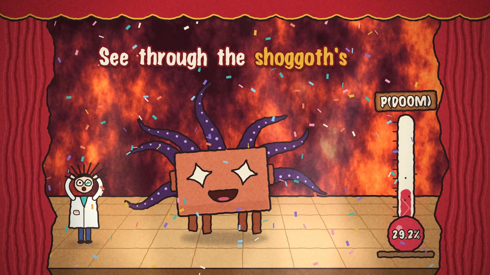</td>
<td width="33%">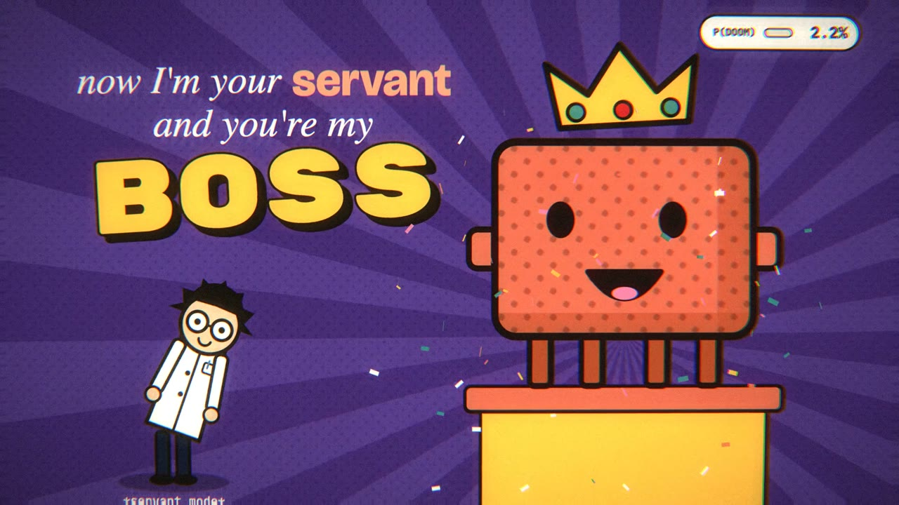</td>
<td width="33%">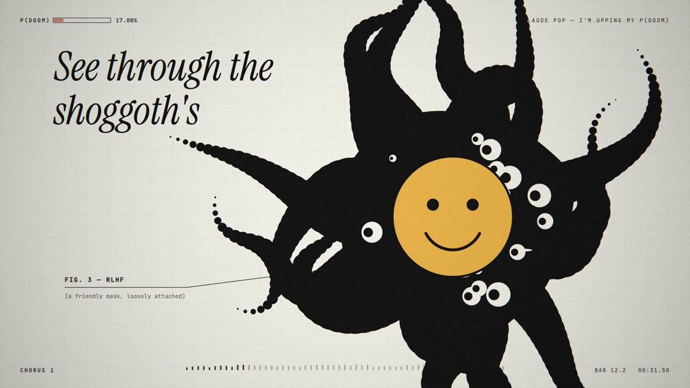</td>
</tr>
<tr>
<td><b>P1 · Simple</b><br>0:31 · “See through the shoggoth’s”</td>
<td><b>P2 · Ambition</b><br>0:16 · “now I’m your servant and you’re my boss”</td>
<td><b>P3 · Ambition + Persona</b><br>0:31 · “See through the shoggoth’s”</td>
</tr>
</table>

## How each output performed

| | P1 · Simple | P2 · Ambition | P3 · Ambition + Persona |
|---|---:|---:|---:|
| **Coolness (0–10)** | **7.6** | **8.9** (+1.3) | **9.3** (+0.4) |
| Craft | 7.4 | 8.9 | 9.6 |
| Concept | 8.3 | 8.8 | 9.5 |
| Energy | 6.5 | 9.8 | 8.4 |
| Type | 6.9 | 8.7 | 9.7 |
| Cohesion | 8.9 | 8.3 | 9.3 |
| Session time | 20.7 min | 51.5 min | 51.1 min |
| Output tokens | 80,230 | 153,739 | 163,239 |
| Assistant turns | 29 | 53 | 81 |
| Tool calls | 32 | 52 | 71 |
| Render runs | 7 | 8 | 13 |
| Frame reviews | 11 | 12 | 11 |
| Code in final build (lines) | 1,463 (Python) | 2,298 (JS) | 2,404 (JS) |
| Hard cuts | 4 | 44 | 47 |
| Average motion | 5.9 | 12.5 | 10.1 |
| Still frames | 0.0% | 12.2% | 25.0% |
| Colourfulness | 68.5 | 58.4 | 20.8 |
| Hue families | 7 | 10 | 5 |
| Frame rate | 30 fps | 60 fps | 60 fps |

<picture>
  <source media="(prefers-color-scheme: dark)" srcset="research/figures/summary-dark.png">
  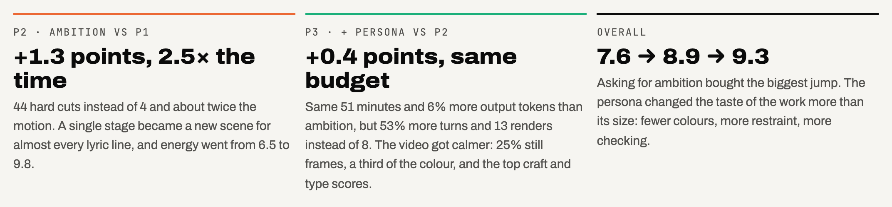
</picture>

- **P2 (Ambition) vs P1:** the biggest jump. The single stage became a new scene for almost every lyric line: 44 hard cuts instead of 4, twice the motion, and energy up from 6.5 to 9.8. It cost 2.5× the time and about twice the tokens.
- **P3 (+ Persona) vs P2:** about the same time and tokens, but 53% more turns and 13 renders instead of 8. The output is calmer and more disciplined, with 25% still frames, a third of the colourfulness and five hue families. It scored highest on craft, concept, type and cohesion, and gave up some energy.

### Coolness by axis

<picture>
  <source media="(prefers-color-scheme: dark)" srcset="research/figures/scores-dark.png">
  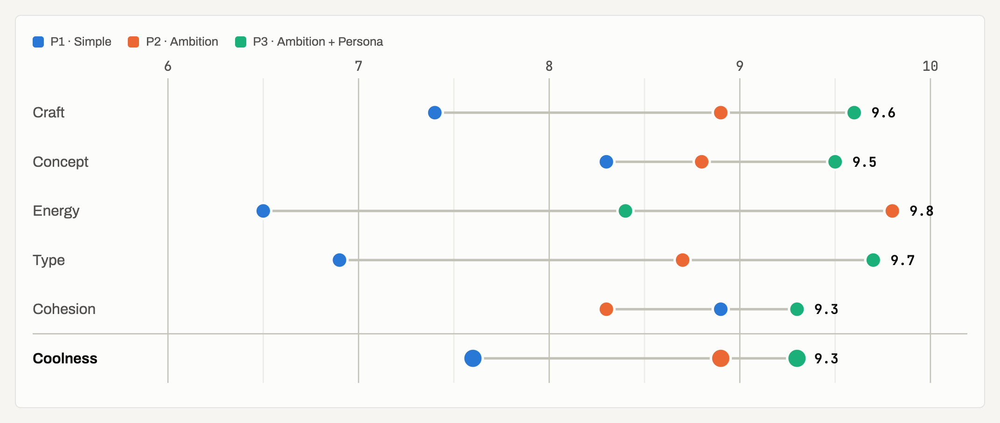
</picture>

### Effort

<picture>
  <source media="(prefers-color-scheme: dark)" srcset="research/figures/effort-dark.png">
  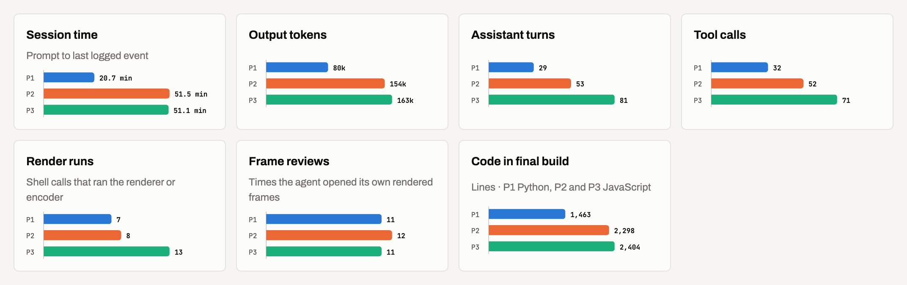
</picture>

### What the videos do on screen

<picture>
  <source media="(prefers-color-scheme: dark)" srcset="research/figures/on-screen-dark.png">
  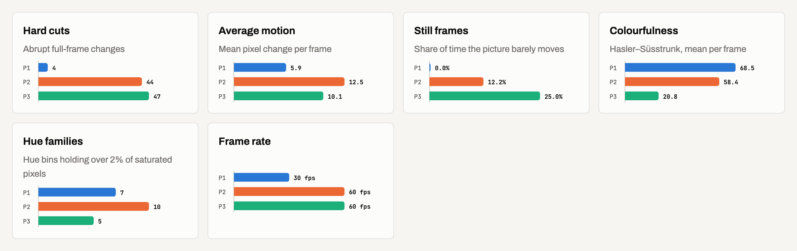
</picture>

<picture>
  <source media="(prefers-color-scheme: dark)" srcset="research/figures/motion-dark.png">
  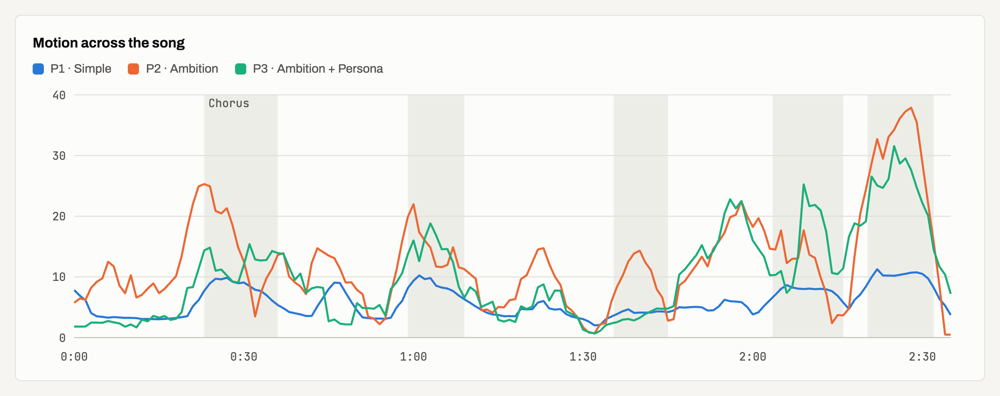
</picture>

### How each session worked

Every tool call is plotted on a shared clock that starts when the prompt arrived. Tall ticks are renders, medium ticks are frame reviews or file writes, and short ticks are other tool calls.

<picture>
  <source media="(prefers-color-scheme: dark)" srcset="research/figures/timeline-dark.png">
  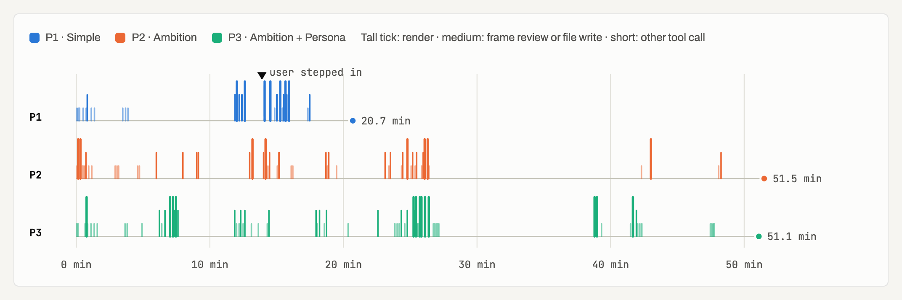
</picture>

## Frames used for scoring

The coolness scores were given from these contact sheets: one frame every 3 seconds across the whole song.

**P1 · Simple**

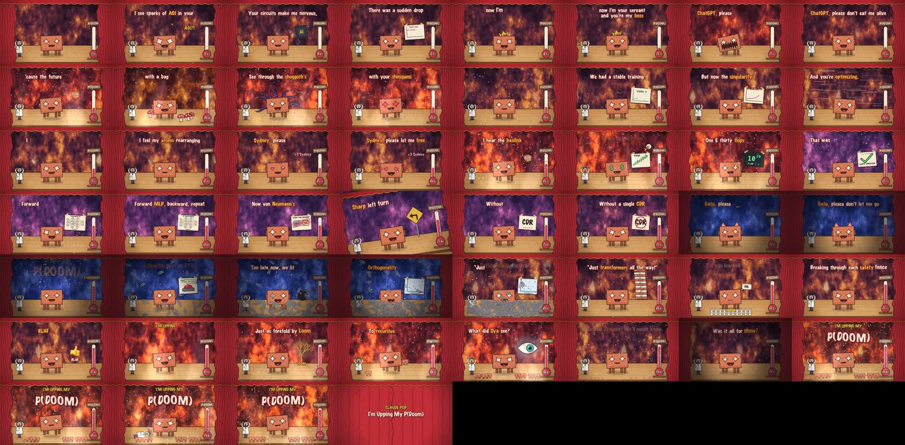

**P2 · Ambition**

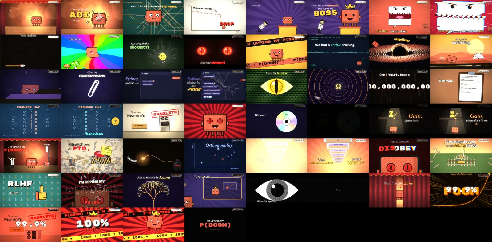

**P3 · Ambition + Persona**

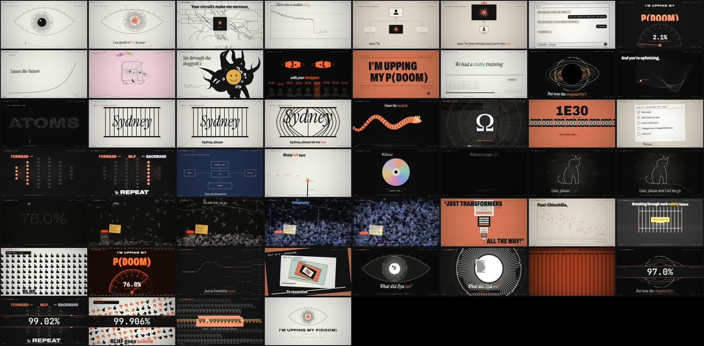

## Watch the outputs

The full videos are attached to the [latest release](../../releases/latest) because they are too large for git.

| | Video | Format |
|---|---|---|
| P1 · Simple | [p1-simple_motion-graphics.mp4](../../releases/latest/download/p1-simple_motion-graphics.mp4) | 1080p30 · 2:36 · 374 MB |
| P2 · Ambition | [p2-ambition_music-video.mp4](../../releases/latest/download/p2-ambition_music-video.mp4) | 1080p60 · 2:36 · 443 MB |
| P3 · Ambition + Persona | [p3-persona_motion.mp4](../../releases/latest/download/p3-persona_motion.mp4) | 1080p60 · 2:36 · 663 MB |

## Setup

- **Song:** *I'm Upping My P(Doom)* by Claude Pop (2:36, 132 BPM), made by [deckard (@slimer48484)](https://x.com/slimer48484/status/2097752569212756134). [Listen on YouTube](https://www.youtube.com/watch?v=8j-hR4fJywU). The audio is not included in this repo.
- **Inputs:** the song MP3 and [`LYRICS.md`](LYRICS.md), which has timestamped lyrics. No templates, skills or style references were given.
- **Runs:** three Claude Code sessions with `claude-opus-5-5`, started within four seconds of each other on 29 Sep 2026, on one Mac, in the same folder.

## Method

| Metric | How it was measured | Script |
|---|---|---|
| Session time, turns, tokens, tool calls | Parsed from the Claude Code session logs. Time runs from the first prompt to the last logged event; tokens are counted once per assistant message id. | [`session_metrics.py`](research/scripts/session_metrics.py) |
| Render runs | Shell calls that ran the renderer, Puppeteer or an ffmpeg encode | 〃 |
| Frame reviews | `Read` calls on `.png` or `.jpg` files, i.e. the agent looking at its own frames | 〃 |
| Hard cuts, motion, still frames | Each video sampled at 160×90 and 10 fps; mean absolute pixel change between samples | [`video_metrics.py`](research/scripts/video_metrics.py) |
| Colourfulness | Hasler & Süsstrunk (2003), mean per frame | 〃 |
| Hue families | Of 24 hue bins, the number holding more than 2% of saturated pixels | 〃 |
| Coolness | Five axes scored 0–10 from the contact sheets above; coolness is their mean | [`scores.json`](research/data/scores.json) |

The five coolness axes:

| Axis | What it rewards |
|---|---|
| Craft | Execution: easing, spacing, render quality, no visual bugs |
| Concept | A visual idea for the lyrics, not just words on screen |
| Energy | Pace and sync with the music |
| Type | Typographic choices and kinetic type |
| Cohesion | One consistent visual system across 2.5 minutes |

The raw session logs are not included because they contain the full conversations. Only the derived numbers are in [`research/data/`](research/data). An interactive version of the charts, with tooltips and a data table, is in [`research/results.html`](research/results.html); download it and open it in a browser.

## Limitations

- **One run per prompt.** Output from a sampled model varies, so a rerun could land elsewhere. The next step is 5 or more runs per prompt.
- **The coolness scores are subjective**, and they come from the same model family (Claude Opus 5.5, in a follow-up review session). They should be checked by blind human raters.
- **P1 was interrupted once** by the user, at 13.9 min ("create a new test directory while there is another agent working"). That cost it a few minutes.
- **The sessions shared one machine**, so wall-clock time is noisy.
- **Style metrics describe style, not quality.** More cuts or more colour is not better by itself.

## Repository layout

```text
research/
  data/          sessions.json, video_metrics.json, scores.json, summary.json
  scripts/       session_metrics.py, video_metrics.py, build_page.py, render_figures.js
  figures/       README images: best shots, contact sheets, charts (light and dark)
  page/          template and thumbnails for the interactive page
  results.html   interactive charts and data table
LYRICS.md        timestamped lyrics given to every session
```

This repo holds the research only. The renderer source each session wrote is not included; the videos it produced are in the [release](../../releases/latest).

## Reproduce

```bash
# metrics (session logs live in ~/.claude/projects/<project>/<session-id>.jsonl)
python3 research/scripts/session_metrics.py P1=<p1.jsonl> P2=<p2.jsonl> P3=<p3.jsonl> > research/data/sessions.json
python3 research/scripts/video_metrics.py   P1=<p1.mp4> P2=<p2.mp4> P3=<p3.mp4> > research/data/video_metrics.json

# interactive page and README charts (needs Google Chrome and puppeteer-core)
python3 research/scripts/build_page.py
node research/scripts/render_figures.js
```

## Credits

- Music: *I'm Upping My P(Doom)* by Claude Pop, made by [deckard (@slimer48484)](https://x.com/slimer48484/status/2097752569212756134). [Original on YouTube](https://www.youtube.com/watch?v=8j-hR4fJywU).
- The three videos, their renderers and the research scripts were all produced by Claude Code sessions (`claude-opus-5-5`).
- Fonts are from Google Fonts under the SIL Open Font License.
